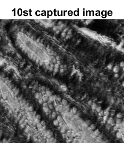
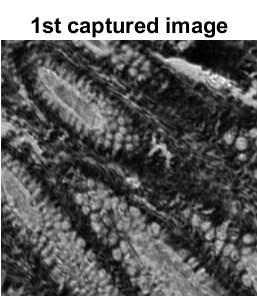
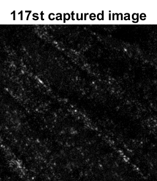
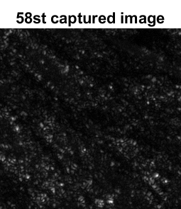
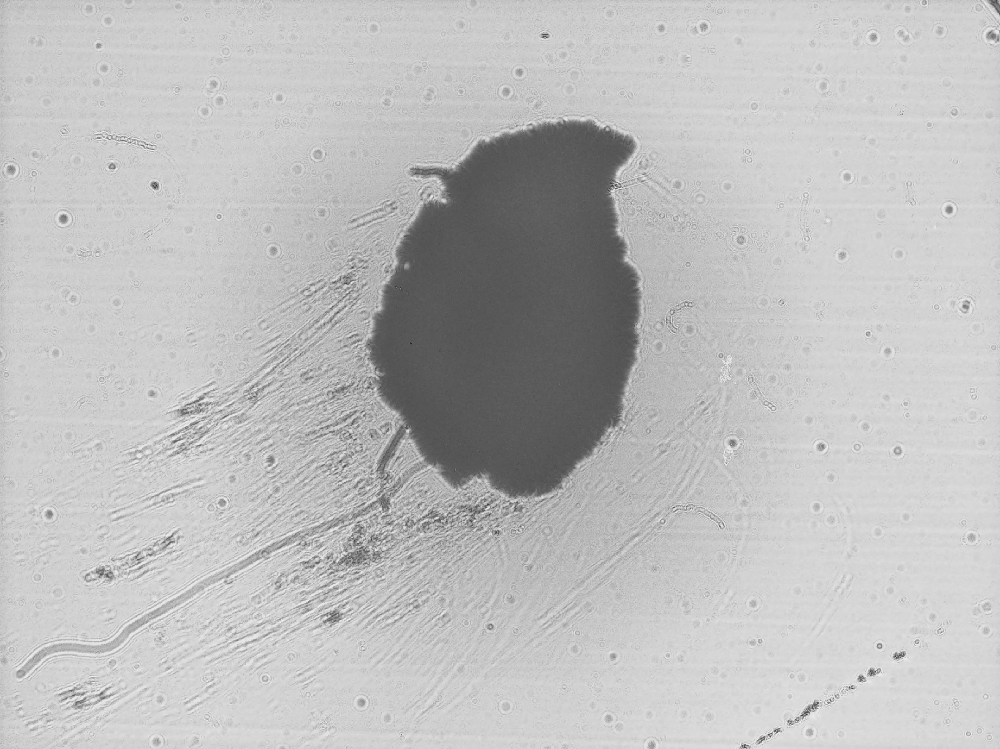
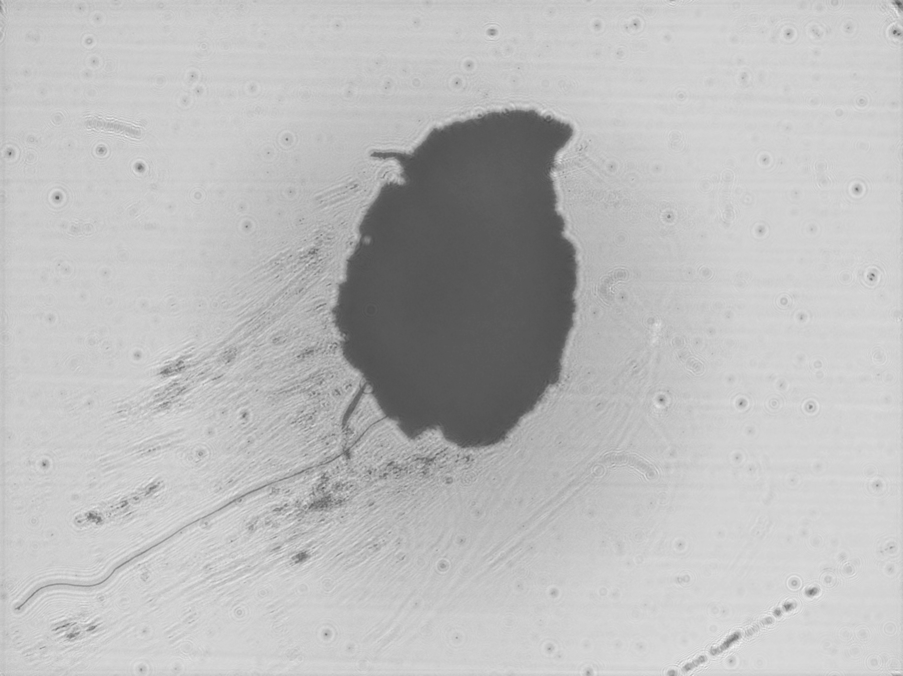
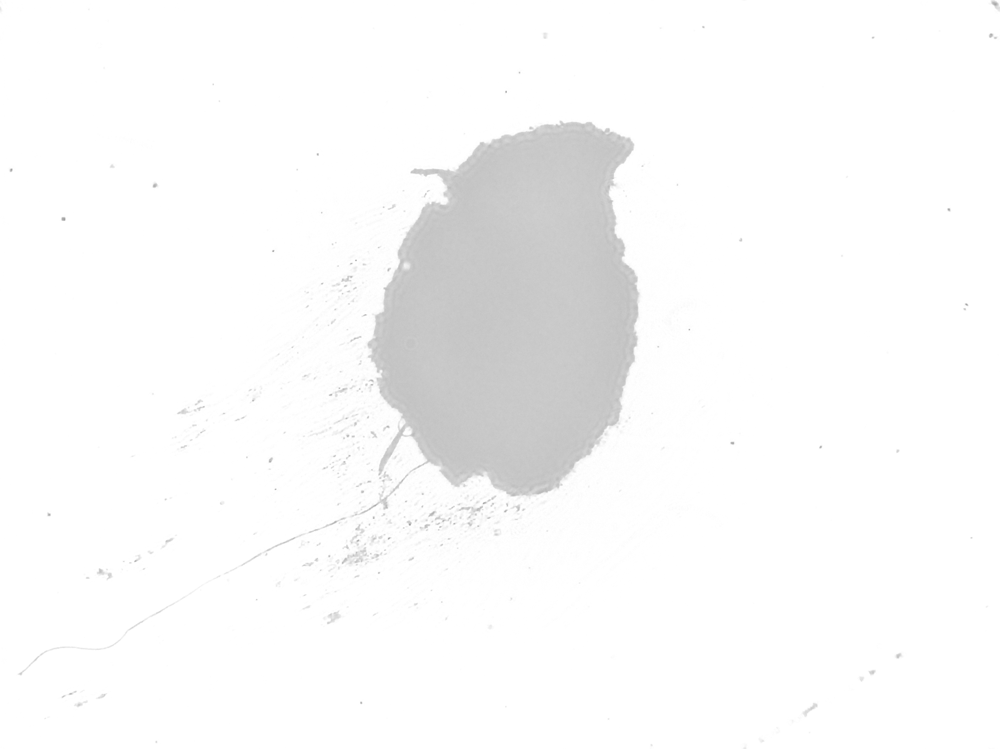

# Test Neysa's template
-------


* TOC
{:toc}


## Equation

Inline: $y=x^2$

Centered: $$y=x^2$$


## Table


| Element | 6    | 7    | 8               | 9    |
| :-----: | ---- | ---- | --------------- | ---- |
|    1    | 7.81 | 3.91 | 1.95            | 0.98 |
|    2    | 6.96 | 3.48 | 1.74            | 0.87 |
|    3    | 6.20 | 3.10 | 1.55            | 0.78 |
|    4    | 5.52 | 2.76 | **1.38**        | 0.69 |
|    5    | 4.92 | 2.46 | 1.23            | 0.62 |
|    6    | 4.38 | 2.19 | 1.10            | 0.55 |


## Code

``` python
import torch
```


## Figure

| ---------------------- | ----------------------- | ----------------------- | ------------------------ |
|  |  |  |  |


**reconstruction**

|`hologram        `|`back propagation`|`autodiff        `|
| ------------------------- | --------------------- | ---------------------------- |
|  |  |  |


## Checkbox
- [ ] unchecked
- [x] checked 

## Project page test

[Project page](index_project)


## Reference

1. Daloglu MU, Ray A, Collazo MJ, Brown C, Tseng D, Chocarro-Ruiz B, Lechuga LM, Cascio D, Ozcan A. [Low-cost and portable UV holographic microscope for high-contrast protein crystal imaging](https://aip.scitation.org/doi/citedby/10.1063/1.5080158). APL Photonics. 2019 Mar 1;4(3):030804.
2. Ting-Wei Su, Serhan O. Isikman, Waheb Bishara, Derek Tseng, Anthony Erlinger, and Aydogan Ozcan, "[Multi-angle lensless digital holography for depth resolved imaging on a chip](https://opg.optica.org/oe/fulltext.cfm?uri=oe-18-9-9690&id=198385)," Opt. Express 18, 9690-9711 (2010)
